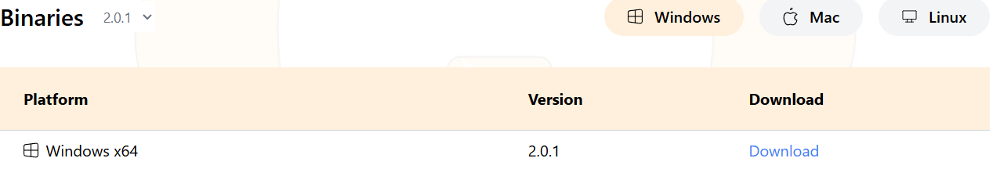
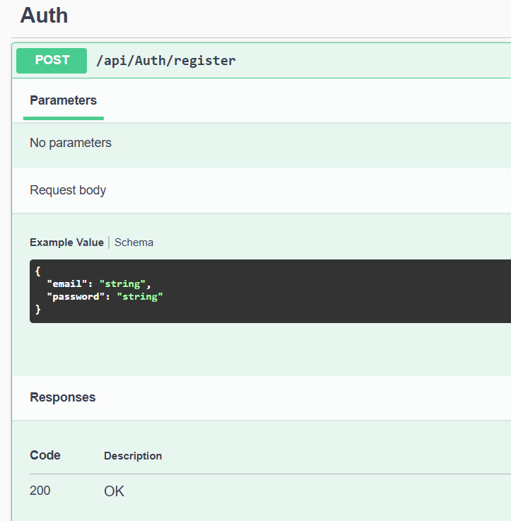
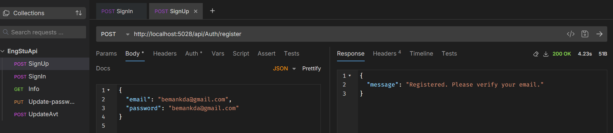
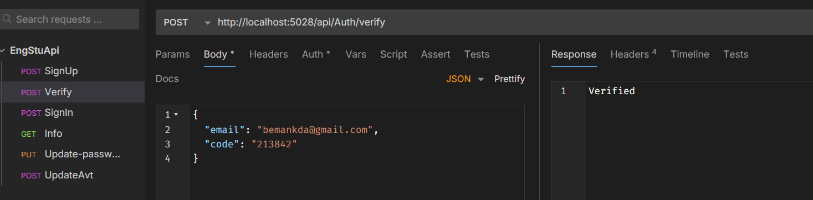
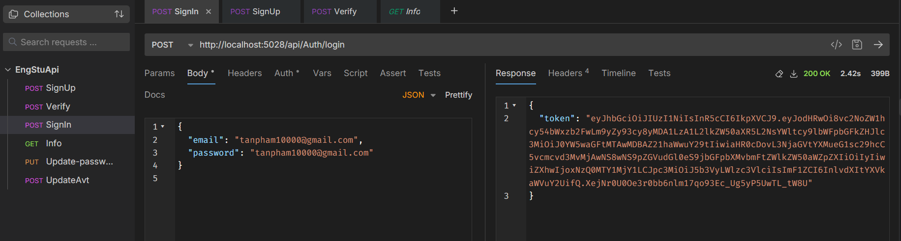
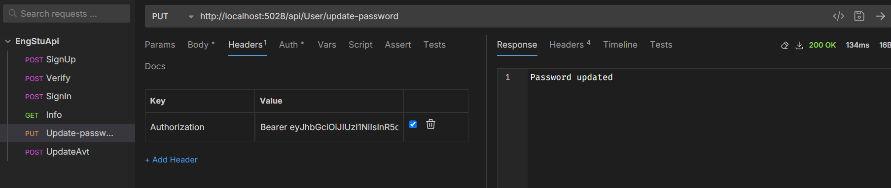
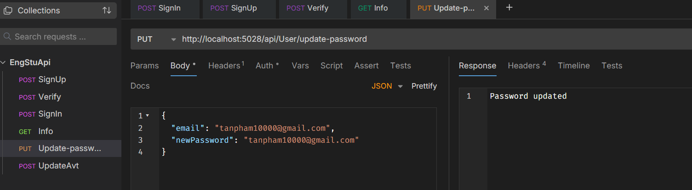

# Langstudio
# Setup backen
# 1. Tải docker postgresdb
docker run --name postgres-container -e POSTGRES_USER=root -e POSTGRES_PASSWORD=myPassword -e POSTGRES_DB=myDataBase -p 5432:5432 -d postgres
# 2. Kết nói backend với db 
cần tải thêm dotnet "dotnet tool install --global dotnet-ef"
dotnet ef migrations add InitialCreat
dotnet ef database update
// dotnet ef database drop (nếu có lỗi thì gỡ đi chạy lênh này)
# 3. Chạy backend
dotnet run (don't build again)
Lúc này backend sẽ ở port http://localhost:5028 (đừng thay đổi port backend)
# Api connect
# 1. Download Bruno
https://www.usebruno.com/downloads 

# 2. Add file EngStuApi
Nhấn vô open sau đó 

Thêm file EngStuApi

# 3. Có 2 loại api 
Truy cập vào http://localhost:5028/Swagger/index.html để hiểu hết về các loại api nhưng sẽ dừng bruno để api testing
http://localhost:5028/Swagger/index.html
-

- Những thông tin cần thiết 

- Loại không xác thực ( các hoạt động trước login)
- Loại có xác thực ( các hoạt động diễn ra sau login)
# 4.Không xác thực
- SignUp, việc này sẽ gửi 1 api kèm theo tên đăng kí và mật khẩu trong bodybody, các api khác cũng tương tự

- Verify /api/Auth/verify

- login /api/Auth/forgot-password
- /api/Auth/forgot-password
- /api/Auth/reset-password
- /api/Auth/register
- /api/Auth/login
# 5. Có xác thực
- Sau khi login backend trả về 1 jwt

- Sau này mọi api sẽ cần lưu jwt này vào trong headers, còn thông tin khác vẫn lưu vào body
- Lưu vào headers thêm "Bearer cvdsnvidsnvidsn...", key là "Authorization"
- Api /api/User/update-password

- Mọi api cần xác thực đều cần "Authorization"

- /api/User/info
# 6. Sau này tất cả các api đều cần xác thực nên hãy lưu jwt, nếu jwt hết hạn thì đăng nhập lại

